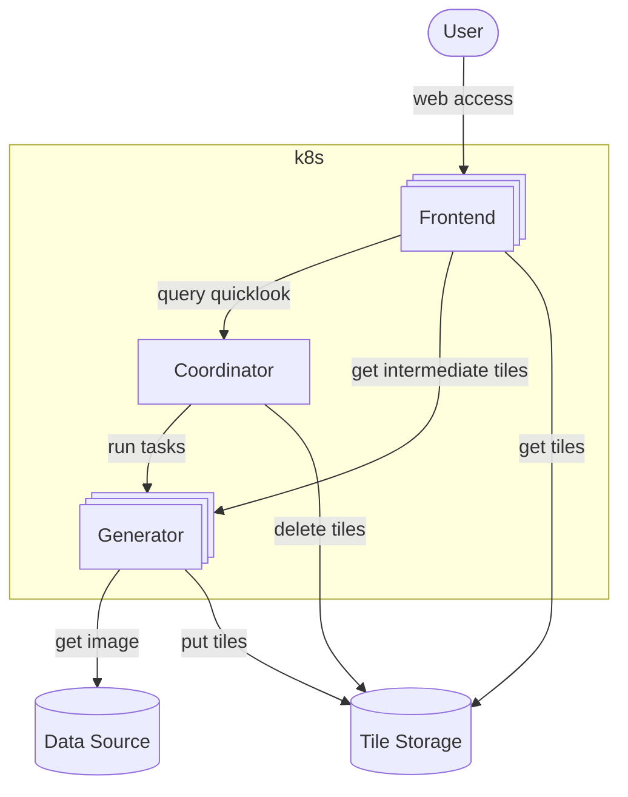
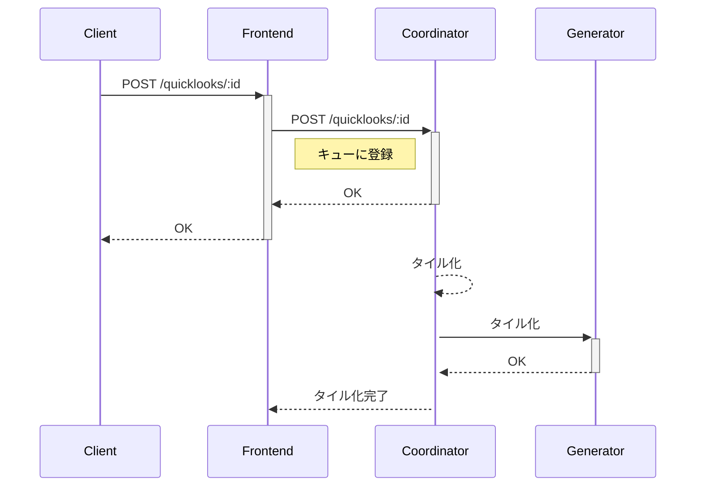
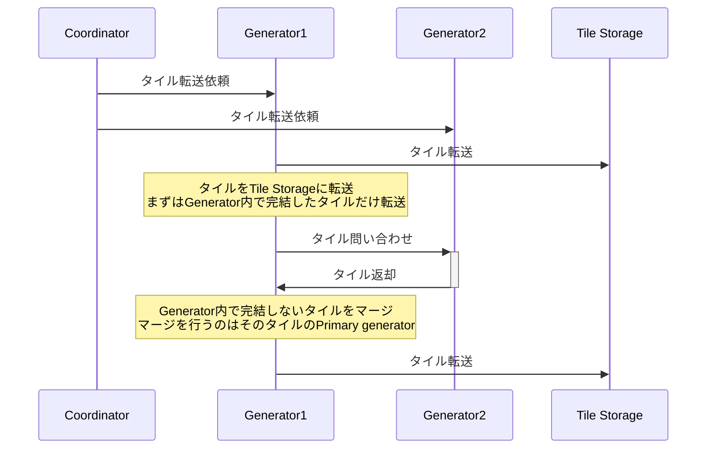
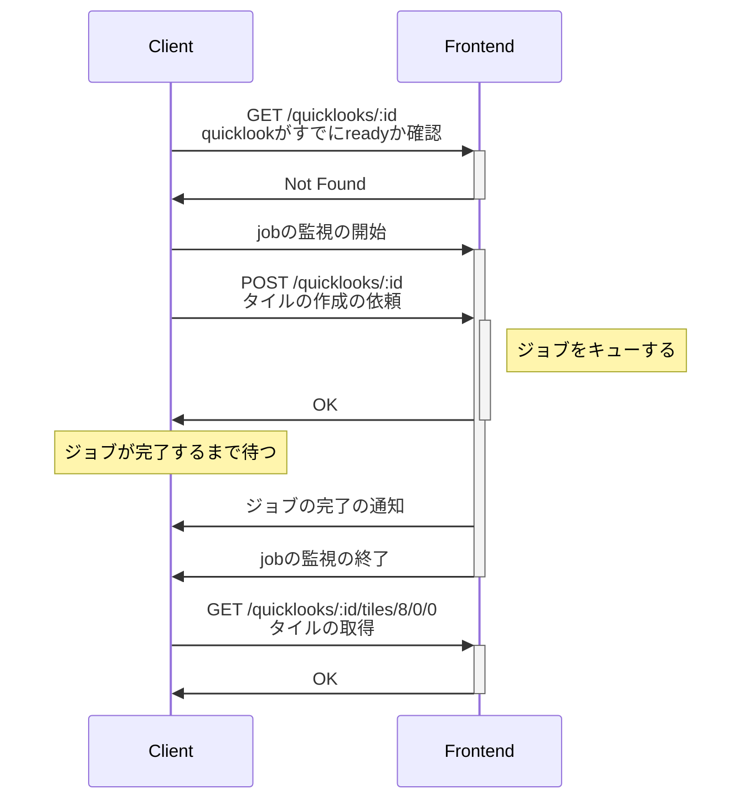

## hot

# FoV Quicklook

このシステムはRubinの1視野のデータを高速にプレビューするためのものである。
高速にプレビューするためには画像をタイルに分割しそれを保存しておく必要がある（この処理をタイル化と呼ぶ）。
タイル化はユーザーからのリクエストがあってから行われる。

## システム概観



* Frontend

  Userとのインターフェースとなる。
  複数のインスタンスがある。

* Coordinator

  Tile生成の進捗管理を行う。

* Generator

  Tile生成を行う。

* Data Source

  データの入手元。Generatorは`butler`などを使いデータを取得する。

* Tile Storage

  生成したTileを保存する。具体的にはs3互換ストレージである。


## 概念

* `Visit`

  `Visit`はこのシステムが対象とする画像の単位。
  タイル化はそれぞれの`Visit`に対して行われる。
  Data Sourceから取得する。
  Visitは1つの文字列でIDされる。
  datasourceが`butler`の場合、idは`embargo:{instrument}:{collection}:{data_type}:{exposure}`のようなものとなる。idの文字列の解釈はData Sourceの実装の詳細に依存する。

  この概念のために`Exposure`という名前も妥当に思えるが、`butler`が画像を特定するために`exposure`という軸も使うために別の名前を使っている。

* `Ccd`

  `Visit`は複数の`Ccd`から構成される。`Ccd`がとある配置で1つの画像として並べられたものが`Visit`となる。
  `Ccd`は1つの整数でidされる。

* `Quicklook`

  タイル化の対象としての`Visit`を表す。タイル化中やタイル化が完了した状態の`Visit`を指す。

## API

`/quicklooks/{id}/status` のようなURLが多い。
`{id}`には`/`を含めることはできないのでbutlerのcollectionを含める際は注意(collectionには`all/raw`のようなものがあるので)。
[参考](https://github.com/fastapi/fastapi/issues/791)

## タイル化の流れ

### タイル生成まで



### タイル転送



## ジョブ

タイル生成の進捗はジョブとして管理される。
基本的にはジョブは進捗に関する情報だけを持つ。
Coordinatorで管理するジョブの配列は次のようなデータである。

```typescript
let queue: QuicklookJob[]

type QuicklookJob = {
  visit_id: string
  status: 'generate:queued' | 'generate:running' | 'transfer:queued' | 'transfer:running' | 'ready' | 'failed'
  processing_progress: ProcessingProgress
  transfer_progress: number
}
```

キューにジョブが登録されると`queue`に新しい`QuicklookJob`が追加され、jobが完了し30秒するとそのジョブは削除される。
キューはCoordinatorからFrontendにpush通知され常に同期する。
クライアントはFrontendからその情報にアクセスする。

### ジョブの実行

ジョブの実行には次のような条件がある

* generating状態のジョブの上限
  * `config.max_generate_jobs`で設定
* タイル転送の並列度
  * `config.max_transfer_jobs`で設定
* 一時保存領域場のquicklookの上限
  * `config.max_temporary_quicklooks`で設定

### 実装

generate_queueとtransfer_queueの２つのキューが。
ジョブが終わったタイミングでキューの情報を更新し、完了したジョブを削除する。


## Database

タイル化されたデータはTile Storageに保存される。
どのデータがタイル化されているかを保持するためにDatabaseを利用する。
なんらかの原因で処理が途中で失敗した時に中間ファイルを消すためにタイル化が始まる前にDatabaseに情報を書き込む。

## クライアント

クライアントはブラウザ上で動作するJavaScriptアプリケーションである。
Quicklookを表示するときは取得するときは次のような流れになる。



ジョブの完了を待つには`/jobs.ws`を監視する。
ジョブは `queued`, `generating`, `transferring`, `ready`, `failed` のいずれかの状態を持つ。
`ready`, `failed` の状態になって30秒するとキューから消える。

## Frontend API

* `GET /visits`

  利用可能なvisitsの一覧を取得。日付やdata typeで絞り込みできる。page, per_pageでページングもできる。

* `Websocket /jobs.ws`

  ジョブの現在の状態をwebsocketで通知。

* `GET /quicklooks/:id`

  特定のvisitの状態を取得。


## Trouble Shooting

### job_pipeline.pyのテスト

`backoff_time`の値が小さすぎるとテストが終わらなくなる。

流れは以下の通り

1. テストプロセスがquicklookを作成
1. テストプロセスが`ws://127.0.0.1:{config.frontend_port}/api/quicklooks/raw:broccoli/status.ws`をwatch
1. テストプロセスがこのwebsocketの`status`が`ready`になるのを待って切断
  * 切断前にwaitを挟むとその分`backoff_time`も増やす必要がある
1. テストプロセスが終了
1. frontendにsigintを送る
1. frontendの終了シーケンスが始まる (`Waiting for background tasks to complete.`)
1. この後にcoordinatorから1つRemoteJobのイベントを送られるとfrontendが正常に終了する。

FastAPIでは`lifespan`で生成したタスク内のwebsocketがrecv中に(sigintなどで)終了シーケンスが始まると、recvが完了するまでlifespanのyieldから返ってこない。
